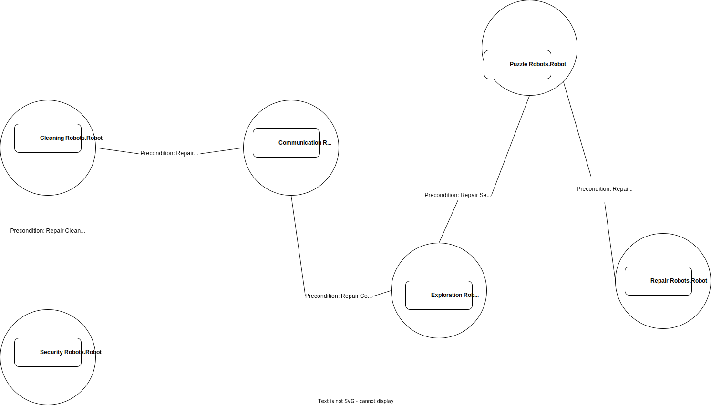
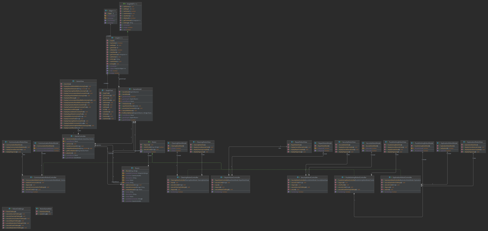

# Welcome to the Robots Facility Simulator! 🤖🚀

This interactive text-based robot facility game takes you on a thrilling journey through a futuristic world filled with malfunctioning robots, mysterious rooms, and mind-bending challenges. Immerse yourself in an engaging narrative, repair robots, solve puzzles, and navigate through interconnected rooms to uncover the secrets within.

## Table of Contents

- [Introduction](#robots-facility-simulator)
- [Features](#features)
- [Getting Started](#getting-started)
- [How to Play](#how-to-play)
- [Technologies Used](#technologies-used)
- [Contributing](#contributing)
- [License](#license)

## Features

- **Immersive Storytelling**: Engage in a captivating storyline filled with suspense, mystery, and unexpected twists.

- **Interactive Challenges**: Interact with various malfunctioning robots, each presenting unique challenges to overcome.

- **Dynamic Room Navigation**: Explore interconnected rooms, each with its own atmosphere and obstacles.

- **Robot Repair**: Repair malfunctioning robots to unlock new rooms and progress in the game.

- **Terminal Visuals**: Experience visually enhanced interactions with robots, with color-coded messages for malfunctioning and repaired states.

## Getting Started

To get started with the Robots Adventure Game, follow these simple steps:

1. **Clone the Repository**:
   
```bash
git clone https://github.com/faycalki/robots-facility-simulator.git
```


2. Compile and run the project

```bash
javac RobotGameMain.java
java RobotGameMain
```

3. **Start Your Adventure**: follow the on-screen instructions.

## How to Play

1. **Interact with Robots**: Use commands like `Interact with Cleaning Robot` to engage with malfunctioning robots.
    
2. **Navigate Through Rooms**: Move between rooms by entering commands like `Go to Security Room`.
    
3. **Repair Malfunctioning Robots**: Solve challenges presented by malfunctioning robots to repair them and unlock new areas.
    
4. **Enjoy the Narrative**: Immerse yourself in the story and make choices that impact the outcome of the game.

### The map


### UML Diagram


## Technologies Used

- **Java**: The game is developed in Java, providing a platform-independent and robust runtime environment.
    
- **Graph Data Structure**: The game utilizes a graph data structure to model the interconnected rooms and facilitate navigation.
    
- **Terminal Visuals**: Enhanced terminal visuals using ANSI escape codes to differentiate robot states.
    

## Contributing

We welcome contributions to enhance the game, add new features, or improve existing ones. Feel free to open issues, submit pull requests, or provide valuable feedback.

## License

This project is licensed under the [MIT License](https://chat.openai.com/c/LICENSE). Feel free to fork, modify, and share the game with others.

---

Embark on an exciting adventure, repair malfunctioning robots, and navigate through a world of mystery and challenges. Enjoy! 🤖🌟